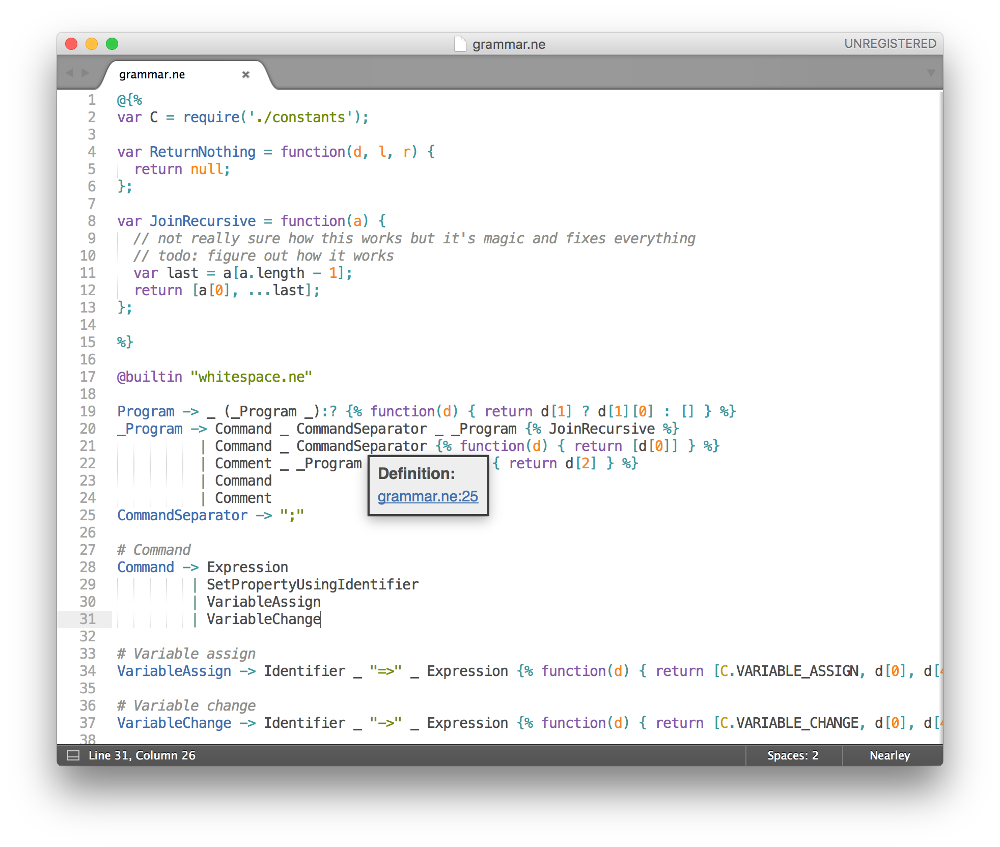

# nearley-syntax-sublime
A syntax theme for [Sublime Text](https://sublimetext.com) to make coding with [Nearley](https://github.com/Hardmath123/nearley) fun.

Install (on OS X and Sublime Text 3):

	$ curl "https://raw.githubusercontent.com/liam4/nearley-syntax-sublime/master/nearley.tmLanguage" > ~/Library/Application\ Support/Sublime\ Text\ 3/Packages/User/nearley.tmLanguage

Install (on OS X and Sublime Text 2):

	$ curl "https://raw.githubusercontent.com/liam4/nearley-syntax-sublime/master/nearley.tmLanguage" > ~/Library/Application\ Support/Sublime\ Text\ 2/Packages/User/nearley.tmLanguage

All those short command line scripts do is download [the theme](https://raw.githubusercontent.com/liam4/nearley-syntax-sublime/master/nearley.tmLanguage) and add them to your packages folder for your Sublime installation, so if you aren't using OS X (a Mac) you can just install them manually, which isn't that much harder than using the program.

The `YAML-tmLanguage` source code is also [available](nearley.YAML-tmLanguage). (Word of warning - it's really short!)
